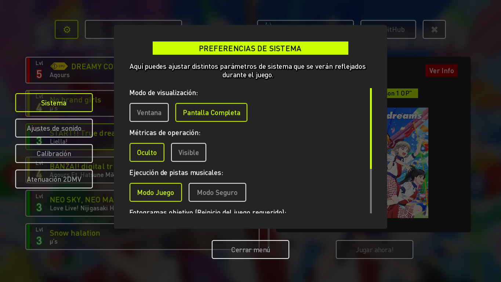
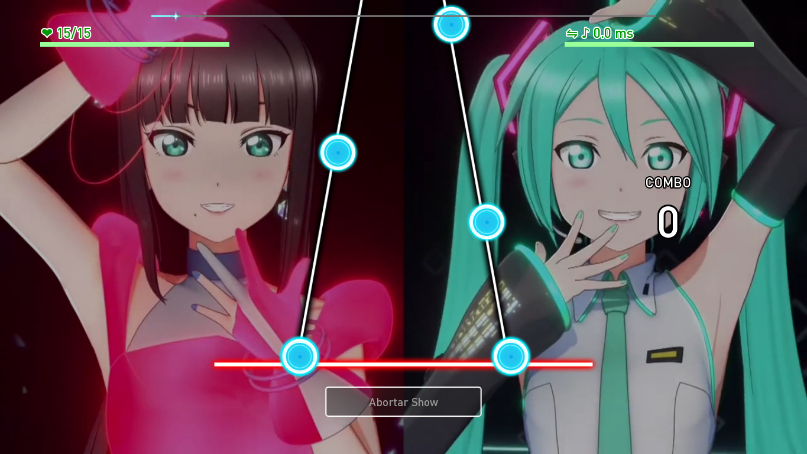
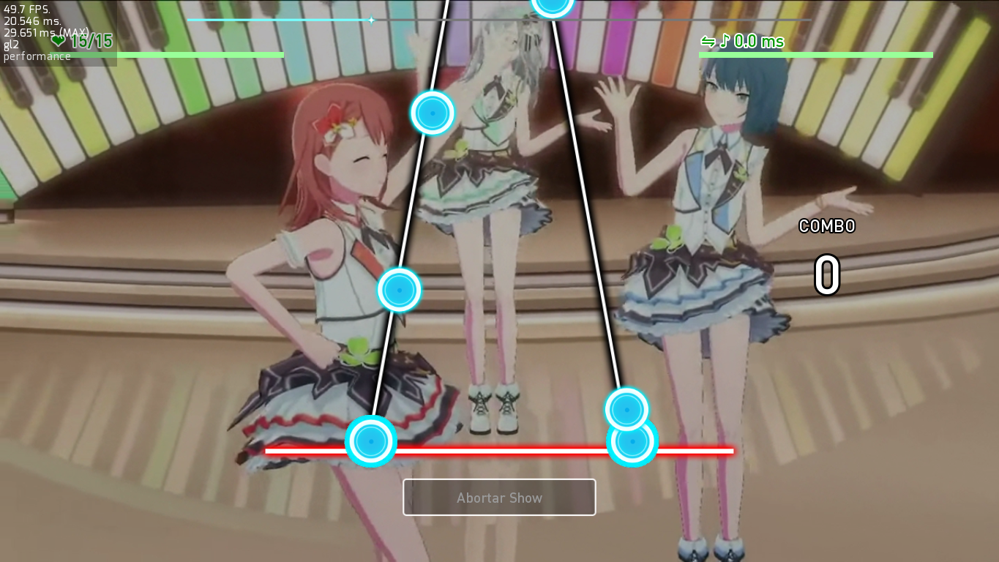
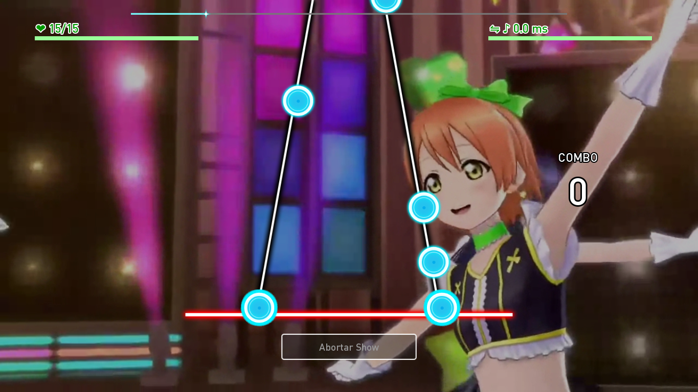
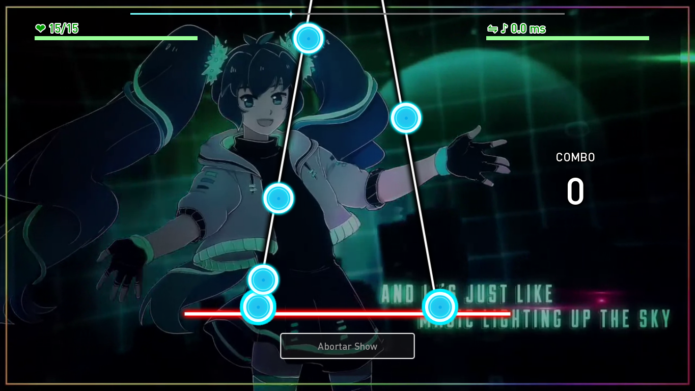
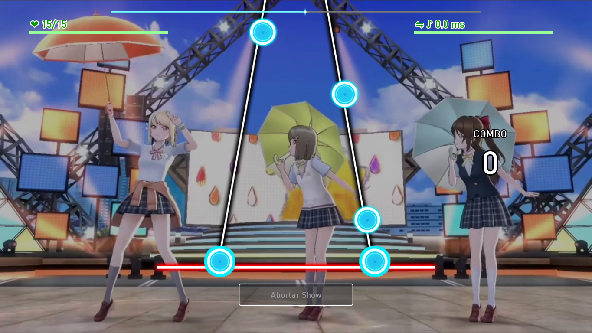
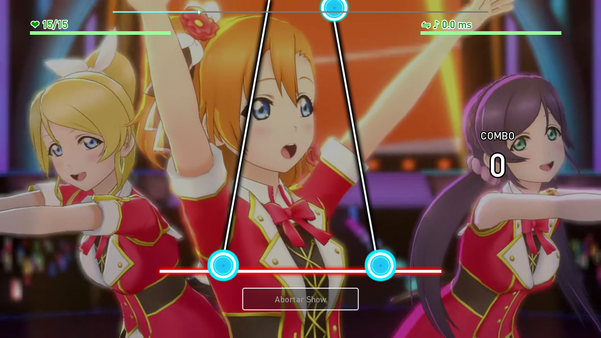

[license]: https://www.gnu.org/licenses/gpl-3.0
[renpy]: https://renpy.org/
[release]: https://github.com/CharlieFuu69/RenPy_RhythmBeats/releases

[renpy-badge]: https://img.shields.io/badge/Ren'Py-v7.4.11-red?style=for-the-badge&logo=python
[license-badge]: https://img.shields.io/badge/License-GPLv3-blue.svg?style=for-the-badge
[status-badge]: https://img.shields.io/badge/Status-Beta-000077?style=for-the-badge
[release-badge]: https://img.shields.io/github/v/release/CharlieFuu69/RenPy_RhythmBeats?style=for-the-badge&logo=github


<p align="center">
  
</p>

<h1 align = "center"> Ren'Py RhythmBeats! </h1>

[![license-badge]][license] [![renpy-badge]][renpy] [![release-badge]][release] ![status-badge]

<h5 align = "center">
    <i>[El módulo ha sido liberado y documentado - ¡Fase beta iniciada!]</i>
</h5>

<p>
  
  <h3> ¡Bienvenido al repositorio! </h3>
</p>

Te contaré un poco acerca de qué trata todo esto.

**Ren'Py RhythmBeats!** es un sistema de Acción Rítmica de 2 pistas que permite integrar la mecánica básica de un juego de ritmo en una novela visual hecha en Ren'Py. Es raro ver novelas visuales con minijuegos de ritmo, pero es una idea loca que tuve a raíz de mi fanatismo por los juegos de ritmo.

#### VENTAJAS DE REN'PY RHYTHMBEATS!:

* **Es simple:** El sistema rítmico que propone **Ren'Py RhythmBeats!** es minimalista, y puede ser fácil de jugar por casi cualquiera.
* **Es poco usual:** En una novela visual, casi nunca se ven minijuegos de este tipo. Añadir este sistema rítmico en una novela visual podría ser innovador :3
* **¡Puedes probarlo!:** He creado un juego demostrativo llamado **"Ren'Py RhythmBeats! Game"** que puedes jugar desde Windows y Android. Hay un total de 19 canciones jugables, de Project SEKAI y Love Live!

#### DESVENTAJAS DE REN'PY RHYTHMBEATS!:

* **Puede ser lento:** Lamentablemente Ren'Py no es un motor que tenga un buen rendimiento, principalmente porque Python no es un lenguaje rápido. A nivel de cómputo, **Ren'Py RhythmBeats!** no tiene problemas, pero a nivel gráfico, puede tener caídas de FPS.
* **El Multitouch:** Estoy intentando expandir la compatibilidad con pantallas táctiles y Android, pero ya que Ren'Py no posee una compatibilidad estable con Multitouch, puede ser más cómodo jugar con un teclado que con pantallas táctiles.

---

<p align="left">
  
  
  <h3> Descargas y más: </h3>
</p>

* **LANZAMIENTO DEL MÓDULO DE REN'PY RHYTHMBEATS (BETA):**

  ¿Quieres empezar a implementar este sistema rítmico en tu proyecto? ¡Revisa estas URLs!
  * **Descarga la última versión de [Ren'Py RhythmBeats! v1.00.1b](https://github.com/CharlieFuu69/RenPy_RhythmBeats/releases/tag/v1.00.1b_module).**
  * **Entérate de cómo implementar el sistema en la [documentación de Ren'Py RhythmBeats!](https://github.com/CharlieFuu69/RenPy_RhythmBeats/blob/main/docs/doc_mainpage.md).**
  
* **JUEGO DEMOSTRATIVO DE REN'PY RHYTHMBEATS!:**

  ¿Quieres pasar el rato jugando la demostración de Ren'Py RhythmBeats? ¡Hay más de 10 canciones con 2DMV!
  * **¡Descarga la última versión del juego (Windows o Android) [en este link](https://github.com/CharlieFuu69/RenPy_RhythmBeats/releases/tag/v1.01.0b_global)!**
  * **¿No sabes cómo jugar la DEMO? Mira los detalles [presionando aquí](DETALLES_DEMO.md)!**

---
### Galería de imágenes de "Ren'Py RhythmBeats! Game":

Es posible que quieras ver el aspecto del juego demostrativo antes de jugarlo. Aquí te dejo unos Screenshots de muestra :3

<p align="center">
  
  
  <br>
  
  
  <br>
  
  
  <br>
  
  
  <br>
  
  
</p>

---

### Registro de actividad reciente:
```   
[10/02/2023 03:47 GMT -3]:
    - He colocado una galería de imágenes de "Ren'Py RhythmBeats! Game", el juego demostrativo de este
      repositorio.
    - Confirmo que la próxima actualización del juego incluirá 2 nuevas canciones para jugar.
    
[19/02/2023 04:05 GMT -3]:
    - Ya he culminado mis labores de despliegue para la nueva actualización global v1.01.0b.
    - "Ren'Py RhythmBeats! Game" ahora posee un port de Android en fase experimental.
    
[22/02/2023 20:17 GMT -3]:
    - Intentaré recalibrar las canciones ya que estoy notando algunos desfases en los beatmaps.
      Esta recalibración se verá reflejada en una próxima Actualización In-Game.
    - Me han enviado una solicitud para traducir el contenido de Ren'Py RhythmBeats hacia otros
      idiomas :3
      Necesitaré actualizar la documentación porque el módulo ha recibido severos cambios.
```

---
### Licencias:
[![license-badge]][license]

Este juego demostrativo/módulo, se distribuye bajo la licencia **[GPL v3.0](license)**.

Si quieres usar o modificar este proyecto, te agradecería que me dieras crédito adjuntando la URL de este repositorio :3

