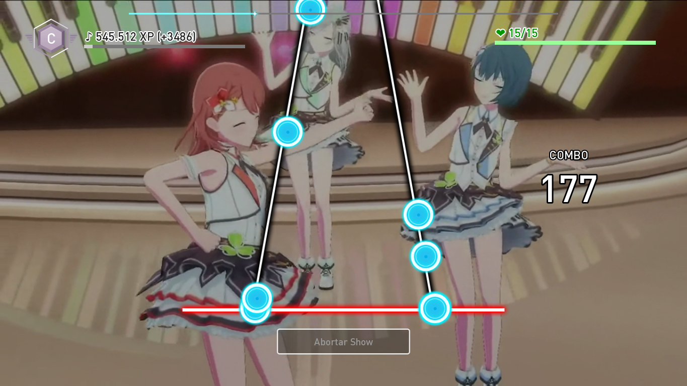

<!-- Links de utilidad pública --->
[license]: https://www.gnu.org/licenses/gpl-3.0
[renpy]: https://renpy.org/
[game-release]: https://github.com/CharlieFuu69/RenPy_RhythmBeats/releases/latest
[module-release]: https://github.com/CharlieFuu69/RenPy_RhythmBeats/releases/tag/v1.02.1b_module
[rbs-documentation]: https://github.com/CharlieFuu69/RenPy_RhythmBeats/wiki
[rbs-game-faq]: https://github.com/CharlieFuu69/RenPy_RhythmBeats/wiki/FAQ

<!-- Badges del README --->
[renpy-badge]: https://img.shields.io/badge/Ren'Py-v7.4.11-red?style=for-the-badge&logo=python
[license-badge]: https://img.shields.io/badge/License-GPLv3-blue.svg?style=for-the-badge&logo=creativecommons
[license-image]: https://www.gnu.org/graphics/gplv3-with-text-136x68.png
[status-badge]: https://img.shields.io/badge/Status-Beta-000077?style=for-the-badge
[release-badge]: https://img.shields.io/github/v/release/CharlieFuu69/RenPy_RhythmBeats?style=for-the-badge&logo=github

  

<h1 align = "center"> Ren'Py RhythmBeats! </h1>

[![license-badge]][license] [![renpy-badge]][renpy] [![release-badge]][game-release] ![status-badge]

<h5 align = "center">
    <i>[Última actualización del código fuente: 27/04/2023 02:21 GMT -4]</i>
</h5>

  
  <h3> ¡Bienvenido al repositorio! </h3>

Te contaré un poco acerca de qué trata todo esto.

**Ren'Py RhythmBeats!** es un sistema de Acción Rítmica de 2 pistas que permite integrar la mecánica básica de un juego de ritmo en una novela visual hecha en Ren'Py. Es raro ver novelas visuales con minijuegos de ritmo, pero es una idea loca que tuve a raíz de mi fanatismo por los juegos de ritmo.

#### VENTAJAS DE REN'PY RHYTHMBEATS!:

* **Es simple:** El sistema rítmico que propone **Ren'Py RhythmBeats!** es minimalista, y puede ser fácil de jugar.
* **Es poco usual:** En una novela visual, casi nunca se ven minijuegos de este tipo. Añadir este sistema rítmico en una novela visual podría ser innovador :3
* **¡Puedes probarlo!:** He creado un juego demostrativo llamado **"Ren'Py RhythmBeats! Game"** que puedes jugar desde Windows y Linux. Hay más de 20 canciones jugables, de Project SEKAI y Love Live!

#### DESVENTAJAS DE REN'PY RHYTHMBEATS!:

* **Puede ser lento con demasiadas notas:**
  Lamentablemente Ren'Py no es un motor que tenga un buen rendimiento, principalmente porque Python no es un lenguaje rápido. A nivel de cómputo, **Ren'Py RhythmBeats!** no tiene problemas, pero a nivel gráfico puede tener problemas si los beatmaps poseen muchas notas.

---

  
  
  <h3> Descargas y más: </h3>

* **MÓDULO DE ACCIÓN RÍTMICA DE REN'PY RHYTHMBEATS! (BETA):**

  ¿Quieres implementar este sistema rítmico en tu proyecto? ¡Revisa estas URLs!
  
  * **Descarga la última versión de [Ren'Py RhythmBeats! (v1.02.1b)][module-release].**
  * **Entérate de cómo implementar el sistema en la [documentación de Ren'Py RhythmBeats!][rbs-documentation].**
  
* **JUEGO DEMOSTRATIVO "REN'PY RHYTHMBEATS! GAME":**

  ¿Quieres pasar el rato jugando la demostración de Ren'Py RhythmBeats? ¡Hay más de 20 canciones con 2DMV!
  
  * **¡Descarga la última versión del juego (Windows/Linux) [en este link][game-release]!**
  * **¿No sabes cómo jugar la DEMO? Mira los detalles [presionando aquí][rbs-game-faq]!**
  
---

  
  
  <h3> ¡Sigue el proyecto en redes sociales!: </h3>

También hay otros medios donde puedes reportar errores y enterarte de las últimas actualizaciones del juego:

* **¡Suscríbete gratis al [Canal de difusión de Telegram](https://t.me/renpy_rhythmbeats)!**
* **¡Únete al [Servidor de Ren'Py RhythmBeats en Discord](https://discord.gg/qk3WggMMRM)!**

---
### Galería de imágenes de "Ren'Py RhythmBeats! Game":

Es posible que quieras ver el aspecto del juego demostrativo antes de jugarlo. Aquí te dejo unos Screenshots de muestra :3

  
  
   
  
  
   
  
  
   
  
  
   
  
  

---
### Descargo de responsabilidad (Juego demostrativo):

El contenido del juego demostrativo y el proyecto en general se ofrece sin fines de lucro, ya que se incluye música y MVs que no son de mi autoría.

El juego y el módulo de acción rítmica son de código abierto y se actualiza periodicamente.

---
### Licencias:
[![license-image]][license]

Este juego demostrativo/módulo, se distribuye bajo la licencia **[GPL v3.0](https://www.gnu.org/licenses/gpl-3.0)**.

Si quieres usar o modificar este proyecto, te agradecería que me dieras crédito adjuntando la URL de este repositorio :3

