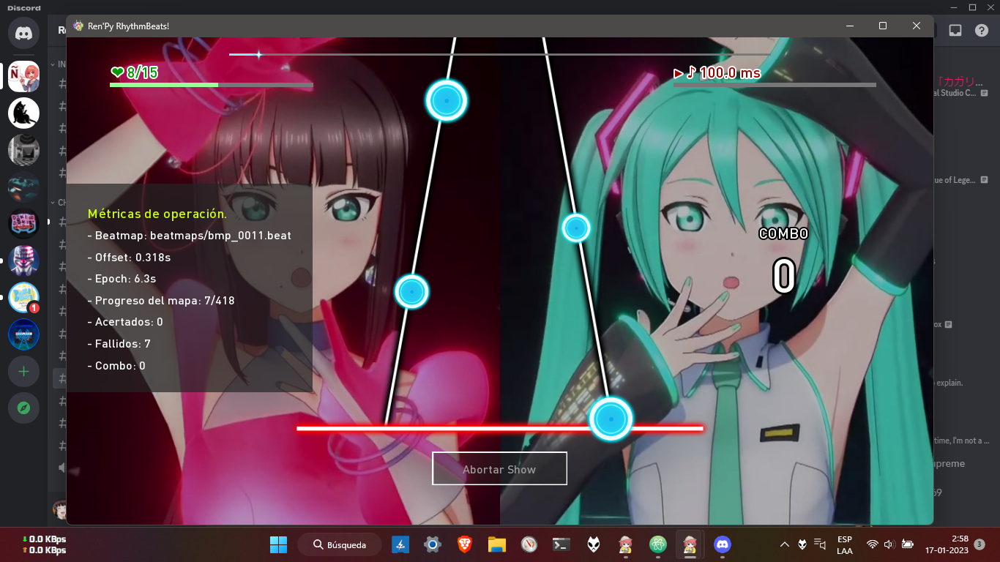
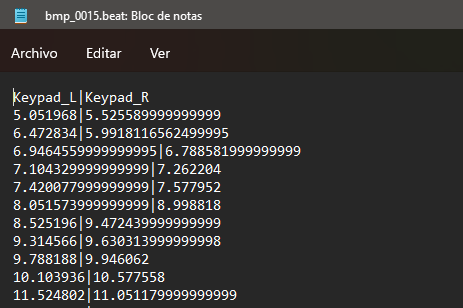

  

<h6 align = "center"> Documentación de "Ren'Py RhythmBeats!" </h1>
<h1 align = "center"> Sección 1: Introducción a Ren'Py RhythmBeats! </h5>

En esta sección verás una introducción acerca del módulo e información de cómo funcionará el sistema de acción rítmica una vez que lo hayas implementado en tu juego.

---

<h3 align="center"> 1. ¿Qué es "Ren'Py RhythmBeats!"? </h3>

<h6 align = "center"> <i>Screenshot: Juego demostrativo de Ren'Py RhythmBeats! con el 2DMV de "BANZAI! digital trippers".</i> </h6>

**Ren'Py RhythmBeats!** es un módulo que te proporciona las funcionalidades básicas para que puedas implementar un minijuego de ritmo en un proyecto de Ren'Py.

Actualmente este sistema de acción rítmica sirve para juegos destinados a <ins>**plataformas de PC**</ins>. Puedes obtener más información acerca de la compatibilidad en la **[Sección 2](doc_section_02.md)** de esta documentación.

Para crear minijuegos, este sistema rítmico proporciona 2 carriles o pistas de notas para la cascada visual en el juego, lo que ayuda a que los jugadores puedan completar las canciones sin muchas complicaciones. No es un sistema rítmico complejo, pero pienso que es suficiente como para una novela visual.

> _Si usas este módulo, te agradecería que dieras crédito a este repositorio o a mí, el creador de **Ren'Py RhythmBeats!** :3_

---

<h3 align="center"> 2. ¿Cómo funciona el sistema de acción rítmica? </h3>

Los conceptos presentes en este ítem son completamente inherentes al sistema rítmico de este repositorio, pero en algunos casos podría ser válido para la mayoría de juegos de ritmo existentes en la actualidad.

---

##### 2.1. El sistema de Beatmaps.

El algoritmo de este módulo y el de casi todos los juegos rítmicos que existen, funcionan respecto de un **"beatmap"**. Los beatmaps (mapas de pulsos) están constituidas de muchas marcas de tiempo (o timestamps) donde cada una de estas marcas de tiempo son equivalentes a una nota que va cayendo por la pantalla.

<h6 align = "center"> <i>Screenshot: Formato de uno de los beatmaps del juego demostrativo.</i> </h6>

Si miraste bien ese screenshot, probablemente ya te diste cuenta de como funciona el beatmap. En lo que respecta a **Ren'Py RhythmBeats!**, este sistema utiliza un formato de beatmap basado en **CSV (Valores separados por comas)** como el que se aprecia en el screenshot.

Las dos columnas que se ven ahí, corresponden a los dos carriles de notas que admite el sistema rítmico. Estos carriles han sido denominados en el archivo como `Keypad_L` y `Keypad_R`. Por supuesto, los números en su interior representan a cada una de las notas que se mostrarán en la pantalla del jugador.

Puedes generar los mapas con algún software musical en formato MIDI y luego procesarlos con la **herramienta de conversión de Ren'Py RhythmBeats!**.

> _**Nota:** Por el momento, "Ren'Py RhythmBeats!" posee su propio formato de archivo Beatmap, pero hay una pequeña posibilidad que en el futuro agregue soporte para charters como "Moonscraper Chart Editor"._

En **[este link](doc_section_05.md)** encontrarás un tutorial y las descargas necesarias para crear secuencias MIDI con FL Studio Mobile, y las instrucciones para convertir el archivo MIDI en un archivo `.beat` mediante la herramienta de conversión.

---

##### 2.2. ¿Cómo se detectan los toques del jugador en Ren'Py RhythmBeats?

En definitiva, cada timestamp de un beatmap es una nota que debe aparecer en el segundo exacto desde que una partida ha iniciado.

En **Ren'Py RhythmBeats!**, se hace uso de un **"Tiempo Epoch"** para detectar la sincronía de los toques del jugador, es decir, un cronómetro que inicia justo cuando la partida ha dado comienzo. Este tiempo Epoch se resta con la nota más cercana al jugador en el momento de presionar una tecla, obteniendo como resultado la cantidad de milisegundos de diferencia entre **el toque del jugador** y el **timestamp más cercano**. Entonces, si esa diferencia está dentro de un rango determinado de milisegundos, el sistema rítmico asume que el jugador pulsó la nota dentro del tiempo admitido.

---

##### 2.3. El "Umbral de Reacción". ¿Qué es esto?

El "umbral de reacción" es <u>el rango de tiempo que el jugador dispone para tocar una nota y acertarla</u>. Esto ayuda a determinar si el jugador acertó o falló una nota que viene cayendo por la pantalla.

Una forma gráfica de representar el "umbral de detección", es la siguiente:

<h6 align = "center"> <i>Gráfico: Umbral de reacción en la cascada de notas.</i> </h6>

Por defecto, el sistema rítmico que pone a disposición el módulo de **Ren'Py RhythmBeats!** tiene fijado un umbral de detección de **100 milisegundos** tanto para toques adelantados o atrasados, lo que permite darle al jugador un total de **200 milisegundos** para acertar una nota. Este tiempo es más que suficiente para que el jugador toque correctamente una nota.

Puedes ajustar ese umbral disminuyendo o incrementando este tiempo. Un tiempo menor al que el módulo trae por defecto requerirá que el jugador sea más preciso tocando las notas, mientras que un mayor tiempo hará que el juego admita pulsos con retraso y aún así contará la nota como tocada.

---

##### 2.5. ¿Qué es el "Offset" de un Beatmap?

Los mapas de un juego de ritmo necesitan ser "calibrados" antes de que una canción pueda ser jugable, pues en muchas ocasiones a pesar de haber hecho correctamente un beatmap, al colocarlo en un juego puede tener ciertos desfases respecto de la canción. He aquí donde nace el concepto de **"Offset"**.

El **Offset** es una compensación de tiempo que se le aplica al beatmap para que las notas caigan de la forma más síncrona que fuese posible, corrigiendo cualquier desfase existente. Por el momento, la calibración de mapas en este módulo debe realizarse manualmente, pero una vez calibrado, el módulo es capaz de recalcular los timestamps según el offset que has configurado.

El módulo permite configurar dos tipos de Offset, pero eso será explicado en el apartado de documentación de código.

---

<h5 align = "center"> ¡Navega por la documentación! </h6>
<h6 align = "center"> <a href="doc_mainpage.md"> Ir al Inicio </a> | <a href="doc_section_02.md"> Ir a la Sección 2</a> </h6>
