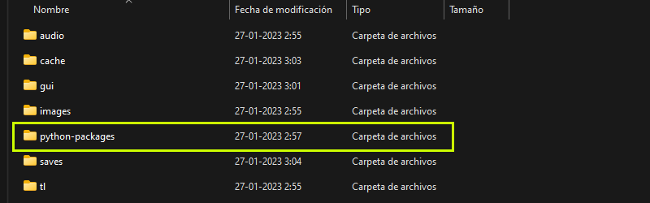

<p align="center">
  
</p>
<h6 align = "center"> Documentación de "Ren'Py RhythmBeats!" </h1>
<h1 align = "center"> Sección 4: Tutorial de implementación </h5>

En esta sección encontrarás toda la información que necesitas para implementar el sistema de acción rítmica en tu juego, basándonos en la información proporcionada en la **[Sección 3](doc_section_03.md)** de esta documentación.

Se garantiza que el código presente en este tutorial (y el código del módulo) **funcionan en Ren'Py v7.3.x o posterior**. No se garantiza que funcione correctamente en versiones más antiguas ya que no ha sido probado.

> _**Nota:** Se recomienda que primero <ins>**hagas un proyecto vacío de Ren'Py antes de implementar definitivamente.**</ins>_

Antes de que continúes, asegúrate de descargar el **[archivo ZIP con el módulo de Ren'Py RhythmBeats!]()** en tu PC, pues de otro modo será imposible implementar esto XD.

Recuerda que los beatmaps **<u>se crean manualmente</u>**. Los tutoriales y recursos para empezar a crear beatmaps están en **[este link](doc_section_05.md)**!

Sin más que decir, ¡vamos a ver cómo debes implementar el sistema rítmico en tu juego!

---

<h3 align="center">1. Importando el módulo en el juego.</h3>

Para empezar a utilizar el sistema rítmico que proporciona **Ren'Py RhythmBeats!** es necesario hacer algunos preparativos para integrar el módulo en tu proyecto.

A continuación se dictan los procedimientos necesarios para concretar la integración del módulo en un proyecto de Ren'Py.

---

##### 1.1. Preparación del juego para integrar el módulo.

Ren'Py manipula los módulos de terceros de una forma bien particular. Para que tu proyecto reconozca al módulo de **Ren'Py RhythmBeats!**, debes crear una carpeta llamada `python-packages` dentro de la carpeta `/game`.

La vista de carpetas debería quedarte así:

<p align="center">
  
</p>

Finalmente, desempaqueta el archivo ZIP descargado y coloca la carpeta `rhythmbeats` en el interior de la carpeta `python-packages`. Una vez hecho eso, ya podrás utilizar por completo al módulo de **Ren'Py RhythmBeats!**

---

##### 1.2. Importación en el juego.

El módulo puedes importarlo en cualquier script RPY de tu proyecto, siempre y cuando lo hagas en algún bloque de arranque o "inicialización".

Dicho esto, para importar el módulo debes hacer lo siguiente:

```renpy
init python:
    import rhythmbeats as rbs
```

Cuando hagas esto, tu proyecto completo podrá utilizar todos los elementos del sistema rítmico. A partir de ese punto, podrás referirte al módulo mediante el nombre `rbs` en tus scripts RPY.

En cuanto a la importación del módulo se recomienda realizarlo en el arranque, puesto que si se importa el módulo durante la marcha, pueden ocurrir errores colaterales en el proyecto.

De cualquier modo si el módulo es importado en la marcha, se lanzará una excepción de tipo `RhythmBeatsException`, señalando que no puedes utilizar el módulo a menos que lo hayas importado en el arranque.

---

<h3 align="center">2. Implementando una UI simple para jugar.</h3>

Ahora, viene la parte donde crearás una UI simple para jugar alguna canción.

En primer lugar, debes tener una imagen para representar las notas en la pantalla, como por ejemplo, la imagen que se usa en el **[juego demostrativo de Ren'Py RhythmBeats!]()**:

<p align="center"></p>
<h6 align = "center"> <i>Imagen: nota musical de 128x128px utilizada en el juego demostrativo.</i> </h6>

Para hacer las cosas más fáciles, puedes definir tu imagen en Ren'Py de esta forma:

```renpy
init:
    image note_tap = "gui/note_tap.png"
```

¡Ahora puedes utilizar tu imagen con el nombre `note_tap`!

---

##### 2.1. Crear una animación ATL para la caída de notas musicales.

Ren'Py nos ayuda a animar displayables mediante el **Lenguaje de Animación y Transformación (ATL)**. Para animar la caida de las notas, puedes crear una transformación como esta:

```renpy
transform note_fall(x, timing):
    subpixel True
    anchor(0.5, 0.5)

    ## Trayectoria
    block:
        alpha 0.0 pos(x, 0.02) ## Posición inicial

        ## Esto permite mostrar la nota un poco antes del timestamp actual
        pause timing - 1.025
        alpha 1.0
        linear 1.0 pos(x, 0.8) ## Trayectoria y posición final
        ease 0.3 alpha 0.0 ## Oculta la nota que ha caido
```

Esta transformación hace que las notas que van cayendo tengan una trayectoria en línea recta de forma vertical.

En este caso recibe 2 argumentos necesarios para trazar la trayectoria de la nota musical:

* **x:**
  
  Recibe un número de punto flotante que representa las coordenadas relativas respecto del eje X de la pantalla. Es decir, si fijas `x = 0.5`, verás caer la nota por el centro de la pantalla.

* **timing:**
  
  Aquí se recibe el timestamp (marca de tiempo) correspondiente a cada nota que quieres mostrar. Recuerda que el Beatmap contiene los timestamps de todas las notas.

Esta transformación será llamada _n_ cantidad de veces según la cantidad de notas que tenga el beatmap.

---

##### 2.2. Crear la Screen que muestra la cascada de notas.

¿Recuerdas la transformación ATL que hicimos en el bloque anterior? Este será el lugar donde la usaremos.

Para mostrar la cascada de notas necesitamos de una screen especialmente para esta actividad, pero la pregunta es otra: _¿Cómo creamos esa screen?_.

Suponiendo que tenemos instanciada la clase `RhythmPlayground()` en una variable llamada `my_instance`, tenemos el siguiente ejemplo:

```renpy
screen note_waterfall():
    zorder 102
    modal True

    ## Esto inicia la lectura de toques del jugador.
    ## Mira la Sección 2 de la documentación.
    add DynamicDisplayable(my_instance.play)

    ## Esto agrega las notas en la pantalla y los hace caer según
    ## el tiempo determinado por el beatmap.
    for padL, padR in my_instance.monocycle_beatmap():
        if isinstance(padL, float):
            add "note_tap" at note_fall(x = 0.35, timing = padL)
        if isinstance(padR, float):
            add "note_tap" at note_fall(x = 0.65, timing = padR)
```

Aquí podemos distinguir que hay dos etapas de trabajo en la screen. La primera parte es una declaración `add` que intenta mostrar un displayable (pero en realidad solo lo usamos para ejecutar la partida xD). Esto hace funcionar el sistema de reconocimiento de taps, sin que nos demos cuenta.

Por otro lado, más abajo tenemos a un bucle `for`, que tiene el propósito de iterar el beatmap entregado por el método `my_instance.monocycle_beatmap()`, para así generar la cascada de notas en la pantalla. Este bucle nos devuelve la marca de tiempo de cada una de las notas mediante las variables `padL` y `padR`, y luego las notas se muestran en la pantalla como `add "note_tap"`.

Este método es en esencia el mismo que utiliza el juego demostrativo de **Ren'Py RhythmBeats!** para mostrar las notas en la pantalla.

---

##### 2.3. Crear la Screen para mostrar el Combo y otros datos.

Esta screen funciona de una manera distinta a la screen del sub-ítem 2.2, ya que esta debe mostrar las estadísticas de juego y debe actualizarse de forma independiente para estar atento al comportamiento de la partida.

Suponiendo que aún tenemos instanciada la clase `RhythmPlayground()` en una variable llamada `my_instance`, tenemos el siguiente ejemplo:

```renpy
screen stage_hud():
    zorder 102

    ## ¿La partida aún se está ejecutando?
    ## Si se está ejecutando, continúa jugando.
    if my_instance.is_running():

        ## ¿Llevas menos de 15 notas perdidas? Aún puedes seguir.
        if my_instance.miss < 15:
            ## Cuadro vertical de estadísticas
            vbox:
                pos(0.1, 0.1)
                text "Notas acertadas: %s" % my_instance.perfect
                text "Notas fallidas: %s" % my_instance.miss
                text "Combo: %s" % my_instance.combo

        ## Alto ahí capo. Ya has fallado demasiadas notas XD
        else:
            python:
                ui.close()
                renpy.jump("stage_failed")

    ## ¿Terminó la partida sin que fallaras? Nice =D
    else:
        python:
            ui.close()
            renpy.jump("stage_cleared")


## Esto hace de que la screen del HUD se refresque constantemente,
## sin afectar el rendimiento de la screen del waterfall.
init python:
    config.per_frame_screens.append("stage_hud")
```

Básicamente en esta screen puedes acceder a los atributos `perfect`, `miss` y `combo` de la clase `RhythmPlayground()` que se van actualizando a medida que la canción se ejecuta.

Dos condicionales evalúan si la partida puede continuar o se detiene. Dentro de la condicional de `my_instance.is_running()` se comprueba si el jugador ha perdido menos de 15 notas. Si fallas más de 15 notas te vas para el lobby xD.

Por supuesto, la cantidad de notas fallidas admitidas queda a tu criterio =D

Lamentablemente las screens no se actualizan constantemente, razón por la que se ha utilizado a `config.per_frame_screens` más abajo. `config.per_frame_screens` es una lista que sirve para actualizar a un grupo específico de screens, sin afectar a otras.

---

<h3 align="center">3. Creando la secuencia de juego.</h3>

Aquí es donde vamos a crear el flujo del código para jugar una canción. Básicamente reuniremos todo lo que hicimos anteriormente y lo ejecutaremos en los `label` para tener control absoluto de la partida.

---

##### 3.1. Instanciando la clase `RhythmPlayground()`.

Parecía que ya nos estábamos olvidando que `RhythmPlayground()` era básicamente el corazón del sistema de acción rítmica, pero no. Aquí es donde la usaremos porque su uso es clave para poder utilizar todo lo que hicimos en el ítem 2.

Teniendo en cuenta que estábamos usando una variable llamada `my_instance` para instanciar la clase, el código debería ser de esta forma:

```renpy
## Aquí comienza el juego
label start:

    python:
        ## Instancia de la clase
        my_instance = rbs.RhythmPlayground(
                        fn = "my_beatmap.beat",
                        offset_map = 0.50,
                        offset_game = 120.0)

        ## Carga el beatmap
        my_instance.load()

        ## (Opcional) Un archivo de audio que se reproducirá cuando
        ## el jugador pierda el combo (BRUH)
        my_instance.miss_sound = "audio/sfx_note_miss.ogg"
```

Hasta aquí tenemos todo bien.

La clase es instanciada de forma global con algunos valores. Por ejemplo, hemos agregado un archivo hipotético de beatmap que se llama `my_beatmap.beat`, que  está en la carpeta `/game` del juego.

Luego, ajustamos este beatmap hipotético con una compensación base de `0.50` segundos (500 milisegundos), y una compensación personalizada de jugador de `120.0` milisegundos (0.12 segundos). Entonces, el Offset final para esta canción será de:

> $0.50 + 0.12 = 0.62seg$

Posterior a ajustar las compensaciones respectivas, cargamos el beatmap con `my_instance.load()` y agregamos un archivo de audio opcional al atributo `my_instance.miss_sound`.

Mantuvimos el `threshold` en su valor por defecto (100 milisegundos) y el juego se ejecutará normalmente ya que el `failsafe` (Modo seguro) es `False`.

---

##### 3.2. Reproduciendo la música para jugar.

Ahora es el turno de la música y de las screens que hicimos.

Para completar la secuencia de juego, dentro del mismo label pero fuera del bloque `python` continuamos el código anterior de la siguiente forma:

```renpy
show screen stage_hud ## Muestra el HUD de la partida
play music "audio/bgm_my_song_file.ogg" ## La canción
call screen note_waterfall ## Muestra la cascada de notas
```

En este caso, primero mostramos la screen `stage_hud` que se encarga de mostrar las estadísticas básicas de juego. Posteriormente reproducimos la pista musical deseada con `play music` y por último mostramos la screen `note_waterfall` que se encarga de mostrar la cascada de notas.

---

#### 3.3. Decidiendo el flujo de la partida.

¿Recuerdas los `renpy.jump()` que pusimos en la screen `stage_hud`? Los `renpy.jump()` son el equivalente pythónico de escribir `jump <label de destino>` en un script RPY, y en nuestro caso, lo usamos para saltar hacia algún label cuando una o más condiciones se cumplan.

Ahora esos labels que llamamos en esos `renpy.jump()` entrarán en acción de la siguiente manera:

```renpy
## ------------------------------------------------------------------- ##
## Labels de partidas finalizadas

label stage_cleared:
    hide screen stage_hud
    hide screen note_waterfall

    "¡Excelente! ¡Terminaste la partida a salvo!"

    ## Elimina la instancia y retorna al menú principal
    $ del my_instance
    return


label stage_failed:
    hide screen stage_hud
    hide screen note_waterfall

    "Oh no. ¡Se te escaparon 15 notas! Has fallado =("

    ## Elimina la instancia y retorna al menú principal
    $ del my_instance
    return
```

El objetivo de estos labels, es de que cuando la partida finaliza, o si el jugador falla muchas notas, el juego necesita continuar su recorrido en algún lugar.

Dicho esto, entonces el label llamado `stage_cleared` se usa cuando el jugador termina la partida sin problemas, independiente de que si falló algunas notas o no. La condicional presente en la screen `stage_hud` apunta a que el jugador puede completar una canción siempre y cuando tenga una cantidad menor a 15 notas fallidas.

Por otro lado tenemos al label llamado `stage_failed`, que este se ejecuta cuando el jugador falló 15 notas durante la partida. En síntesis, cuando el jugador haya fallado 15 notas, la partida se detendrá incluso si aún no terminaba la canción.

Por último al finalizar en estos labels, la instancia actual es eliminada mediante `$ del`, lo que es útil para que el sistema rítmico inicie en limpio nuevamente y puedas usarlo en una nueva canción.

---

<h3 align="center">4. Código completo de este tutorial.</h3>

Para sintetizar la secuencia completa que debes hacer en tu juego, te dejo el código de ejemplo completo aquí abajo para que lo analices con mayor detenimiento.

Para probarlo en un proyecto vacío, reemplaza todo el contenido del archivo `script.rpy` y pega el código a continuación.

```renpy
## Archivo script.rpy

## Importación del módulo
init python:
    import rhythmbeats as rbs

## ----------------------------------------------------------------- ##
## APARTADO DE DEFINICIONES DE IMÁGENES

## Recuerda que la ruta debe ser un archivo de imagen válido
init:
    image note_tap = "gui/note_tap.png"


## ----------------------------------------------------------------- ##
## APARTADO DE ATL

transform note_fall(x, timing):
    subpixel True
    anchor(0.5, 0.5)

    ## Trayectoria
    block:
        alpha 0.0 pos(x, 0.02) ## Posición inicial

        ## Esto permite mostrar la nota un poco antes del timestamp actual
        pause timing - 1.025
        alpha 1.0
        linear 1.0 pos(x, 0.8) ## Trayectoria y posición final
        ease 0.3 alpha 0.0 ## Oculta la nota que ha caido


## ----------------------------------------------------------------- ##
## APARTADO DE SCREENS

## Cascada de notas
screen note_waterfall():
    zorder 102
    modal True

    ## Esto inicia la lectura de toques del jugador.
    ## Mira la Sección 2 de la documentación.
    add DynamicDisplayable(my_instance.play)

    ## Esto agrega las notas en la pantalla y los hace caer según
    ## el tiempo determinado por el beatmap.
    for padL, padR in my_instance.monocycle_beatmap():
        if isinstance(padL, float):
            add "note_tap" at note_fall(x = 0.35, timing = padL)
        if isinstance(padR, float):
            add "note_tap" at note_fall(x = 0.65, timing = padR)


## HUD de la partida
screen stage_hud():
    zorder 102

    ## ¿La partida aún se está ejecutando?
    ## Si se está ejecutando, continúa jugando.
    if my_instance.is_running():

        ## ¿Llevas menos de 15 notas perdidas? Aún puedes seguir.
        if my_instance.miss < 15:
            ## Cuadro vertical de estadísticas
            vbox:
                pos(0.1, 0.1)
                text "Notas acertadas: %s" % my_instance.perfect
                text "Notas fallidas: %s" % my_instance.miss
                text "Combo: %s" % my_instance.combo

        ## Alto ahí capo. Ya has fallado demasiadas notas XD
        else:
            python:
                ui.close()
                renpy.jump("stage_failed")

    ## ¿Terminó la partida sin que fallaras? Nice =D
    else:
        python:
            ui.close()
            renpy.jump("stage_cleared")


## Esto hace de que la screen del HUD se refresque constantemente,
## sin afectar el rendimiento de la screen del waterfall.
init python:
    config.per_frame_screens.append("stage_hud")


## ----------------------------------------------------------------- ##
## FLUJO/SECUENCIA DE JUEGO

## Aquí comienza el juego
label start:

    python:
        ## Instancia de la clase
        my_instance = rbs.RhythmPlayground(
                        fn = "my_beatmap.beat",
                        offset_map = 0.50,
                        offset_game = 120.0)

        ## Carga el beatmap
        my_instance.load()

        ## (Opcional) Un archivo de audio que se reproducirá cuando
        ## el jugador pierda el combo
        my_instance.miss_sound = "audio/sfx_note_miss.ogg"

    ## Ejecución del juego
    show screen stage_hud ## Muestra el HUD de la partida
    play music "audio/bgm_my_song_file.ogg"
    call screen note_waterfall ## Muestra la cascada de notas

## ------------------------------------------------------------------- ##
## Labels de partidas finalizadas

label stage_cleared:
    hide screen stage_hud
    hide screen note_waterfall

    "¡Excelente! ¡Terminaste la partida a salvo!"

    ## Elimina la instancia y retorna al menú principal
    $ del my_instance
    return

label stage_failed:
    hide screen stage_hud
    hide screen note_waterfall

    "Oh no. ¡Se te escaparon 15 notas! Has fallado =("

    ## Elimina la instancia y retorna al menú principal
    $ del my_instance
    return
```

---

<h5 align = "center"> ¡Navega por la documentación! </h6>
<h6 align = "center"> <a href="doc_section_03.md"> Ir a la Sección 3 </a> | <a href="doc_section_05.md"> Ir a la Sección 5</a> </h6>
